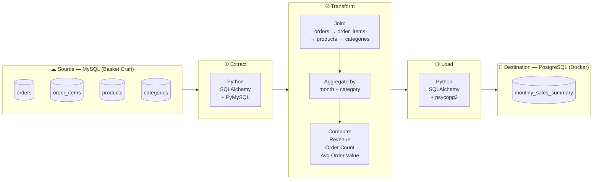

# Basket Craft Data Pipeline

## Architecture Diagram



## Target Table Schema

**`monthly_sales_summary`** (PostgreSQL)

| Column            | Type    | Description                          |
|-------------------|---------|--------------------------------------|
| `month`           | DATE    | First day of the month (YYYY-MM-01)  |
| `category_name`   | TEXT    | Product category                     |
| `revenue`         | NUMERIC | SUM(quantity × unit_price)           |
| `order_count`     | INTEGER | COUNT(DISTINCT order_id)             |
| `avg_order_value` | NUMERIC | revenue / order_count                |

## Source Tables (MySQL)

| Table          | Key Columns                                         |
|----------------|-----------------------------------------------------|
| `orders`       | order_id, customer_id, order_date, status           |
| `order_items`  | order_item_id, order_id, product_id, quantity, unit_price |
| `products`     | product_id, product_name, category_id              |
| `categories`   | category_id, category_name                         |
```
