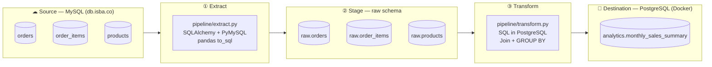

# Basket Craft Data Pipeline

## Architecture Diagram

## Target Table Schema

**`analytics.monthly_sales_summary`** (PostgreSQL)

| Column             | Type      | Description                          |
|--------------------|-----------|--------------------------------------|
| `month`            | DATE      | First day of the month (YYYY-MM-01)  |
| `product_name`     | VARCHAR   | Product name                         |
| `total_revenue`    | DECIMAL   | SUM(quantity × price_usd)            |
| `order_count`      | INTEGER   | COUNT(DISTINCT order_id)             |
| `avg_order_value`  | DECIMAL   | total_revenue / order_count          |
| `total_items_sold` | INTEGER   | SUM(quantity)                        |
| `loaded_at`        | TIMESTAMP | When the pipeline last ran           |

## Source Tables (MySQL)

| Table          | Key Columns                                              |
|----------------|----------------------------------------------------------|
| `orders`       | order_id, customer_id, order_date, status                |
| `order_items`  | order_item_id, order_id, product_id, quantity, price_usd |
| `products`     | product_id, product_name, category_id                    |
